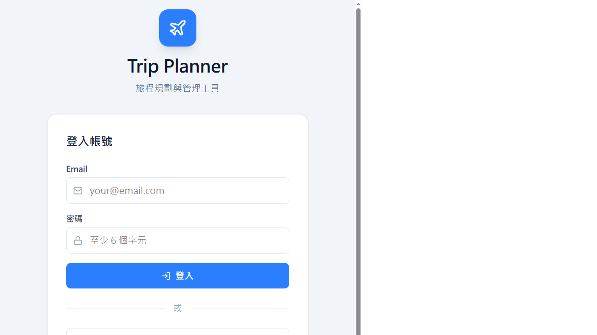
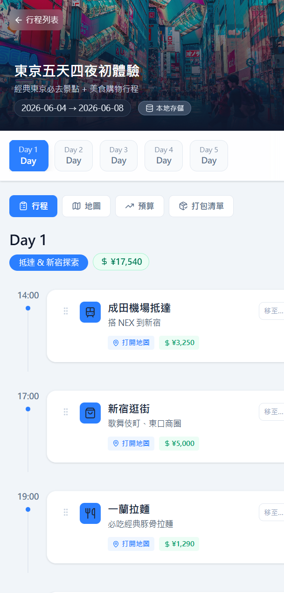
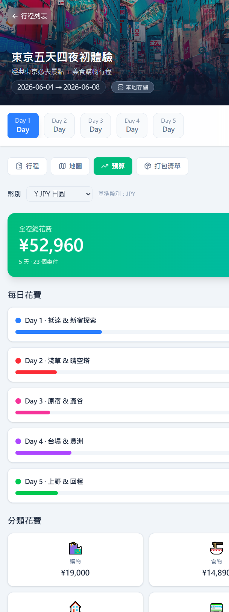
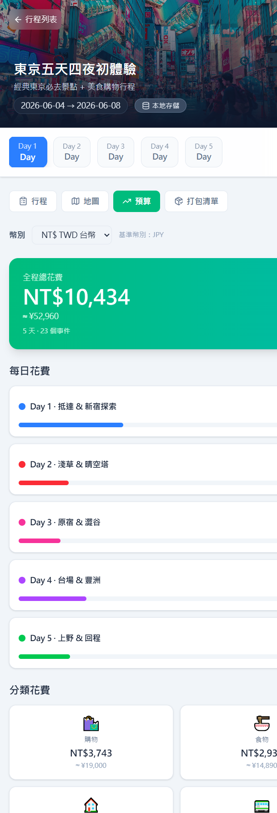
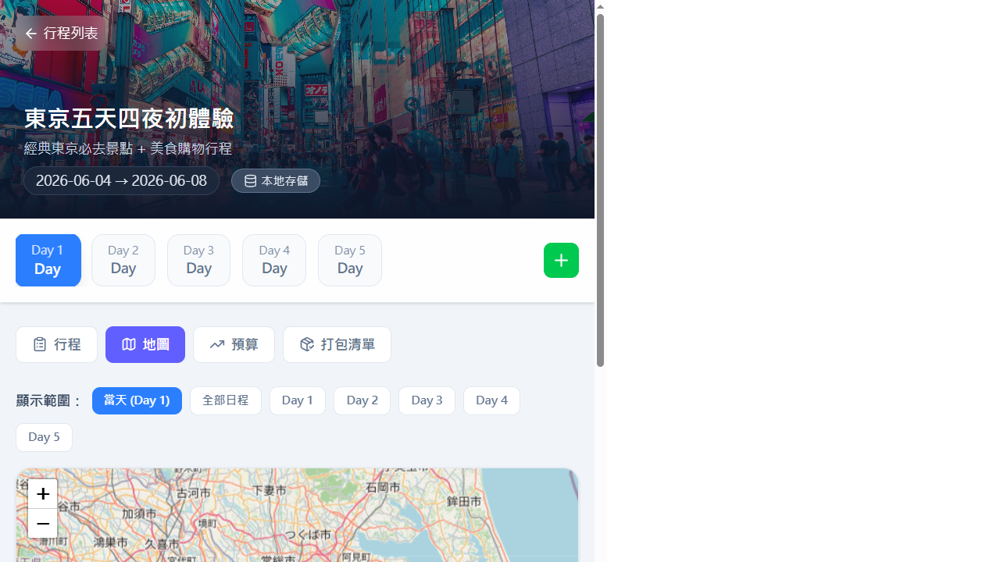
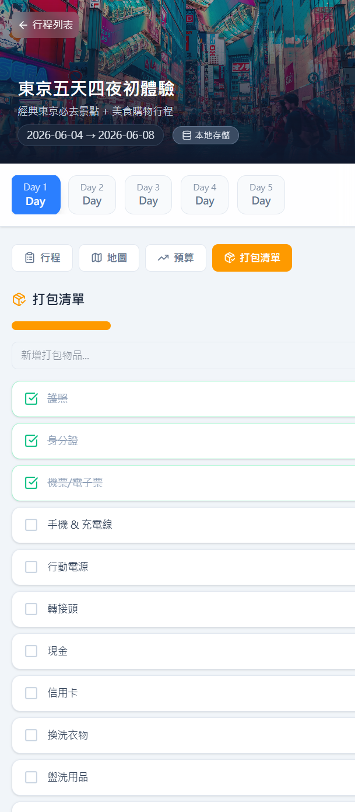

# Trip Planner ✈️

> React + Vite + Supabase 打造的一站式旅遊行程規劃 SPA。
> 支援多行程管理、行程時間軸、互動地圖、多幣別預算追蹤、打包清單，以及雲端同步。

---

## 產品展示

### 登入頁面
支援 Email / Google 登入，或直接使用本地模式。



### 行程列表
一目瞭然管理所有旅程，可從頭建立或一鍵套用範本。


### 行程時間軸
依天/時段排列事件，支援拖曳排序、跨天移動、智慧分類。



### 預算追蹤（多幣別換算）
所有花費以 JPY 為基準儲存，可即時切換 TWD / USD / EUR / KRW 顯示。

| JPY 顯示 | TWD 換算 |
| :---: | :---: |
|  |  |

### 地圖整合
結合 Leaflet + OpenStreetMap，標記所有景點並顯示路線。



### 打包清單
內建常用物品一鍵加入，勾選進度一覽無遺。



---

## 專案亮點

- **多行程管理**：可建立多筆旅行，快速切換不同旅程
- **行程編排**：支援 Day / Event 新增、編輯、刪除、拖曳排序
- **智慧分類**：輸入關鍵字自動分類（食物、交通、購物等）
- **動態組別**：建立分組（如「美食組」），支援分組時間軸並排顯示
- **地圖整合**：Leaflet + Nominatim 地理編碼，標記地點並顯示路線
- **多幣別預算**：以 JPY 為基準，即時換算 TWD / USD / EUR / KRW（1 小時快取）
- **打包清單**：新增、勾選、刪除，預設常用物品一鍵加入
- **雲端同步**：Supabase Auth + Postgres + RLS（本地模式 fallback 至 localStorage）
- **一鍵範本**：東京 / 首爾 / 大阪京都 範本行程秒速套用

## 技術棧

| 類別 | 技術 |
| --- | --- |
| 前端框架 | React 19 + Vite 7 |
| 樣式 | Tailwind CSS 4 |
| 後端 / 資料庫 | Supabase（PostgreSQL + Auth + RLS）|
| 地圖 | Leaflet + react-leaflet + OpenStreetMap Nominatim |
| 拖曳排序 | @dnd-kit |
| 匯率 API | open.er-api.com（1 小時 localStorage 快取）|
| 部署 | GitHub Pages（`npm run deploy`）|
| 語系 | zh-TW |

## 專案結構

```text
src/
  components/
    AuthPage.jsx          # 登入 / 註冊
    TripList.jsx           # 行程列表 + 範本
    TripDetail.jsx         # 行程詳情（時間軸 + 事件 CRUD）
    TripMap.jsx            # Leaflet 地圖
    EventTimelineGroup.jsx # 分組時間軸
    GroupSelector.jsx      # 組別管理
    tabs/
      BudgetTab.jsx        # 預算分頁（多幣別換算）
      PackingTab.jsx       # 打包清單分頁
  hooks/
    useAuth.js             # Supabase Auth hook
    useDebouncedEffect.js  # 防抖副作用 hook
  services/
    exchangeRate.js        # 匯率 API + formatCost
    supabaseService.js     # Supabase CRUD 封裝
  utils/
    dataTransform.js       # 資料轉換工具
  supabaseClient.js        # Supabase 初始化
```

## 快速開始

### 1) 安裝依賴

```bash
npm install
```

### 2) 設定環境變數

建立 .env：

```env
VITE_SUPABASE_URL=your_supabase_url
VITE_SUPABASE_ANON_KEY=your_supabase_anon_key
```

### 3) 啟動開發

```bash
npm run dev
```

預設網址：

http://localhost:5173/tokyo-trip/

### 4) 產生建置

```bash
npm run build
```

## Supabase 必要檢查

請確認下列條件：

1. public.users, trips, days, events, groups 資料表已建立
2. RLS 與 Policy 已啟用（authenticated user 可操作自己的資料）
3. auth.users -> public.users 觸發器存在
4. events 表有 cost 欄位

可在 SQL Editor 執行：

```sql
ALTER TABLE public.events ADD COLUMN IF NOT EXISTS cost numeric DEFAULT 0;
```

```sql
SELECT tgname
FROM pg_trigger
WHERE tgname = 'on_auth_user_created';
```

```sql
SELECT column_name
FROM information_schema.columns
WHERE table_schema = 'public'
	AND table_name = 'events'
	AND column_name = 'cost';
```

## Demo 流程

1. 進入首頁，選擇登入或使用本地模式
2. 建立新行程或套用範本（東京 / 首爾 / 大阪京都）
3. 進入行程詳情，新增 Day 與 Event（含時間、地點、花費）
4. 切換「地圖」分頁查看標記與路線
5. 切換「預算」分頁，切換幣別查看即時換算
6. 切換「打包清單」分頁，勾選已完成物品
7. 回行程列表，刷新頁面確認資料可回載

## 貢獻指南

請參閱 [CONTRIBUTING.md](CONTRIBUTING.md)。
所有 commit 須遵循 Conventional Commits 規範。
5. 預算與匯率換算正常
6. 重新整理後資料仍可從雲端回載

## 專案狀態

- 核心功能：完成
- 雲端整合：完成
- 最終驗證：通過

## 授權

課程專案使用。
